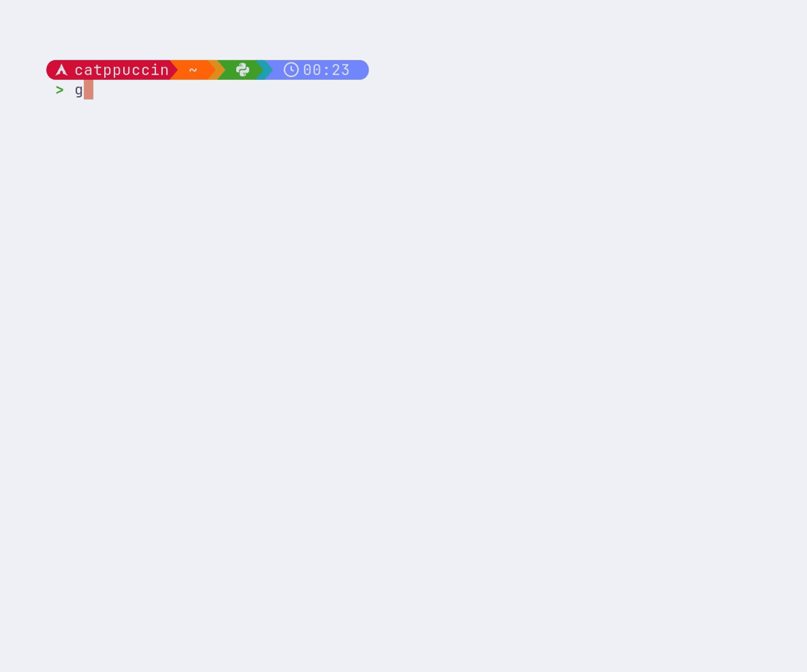
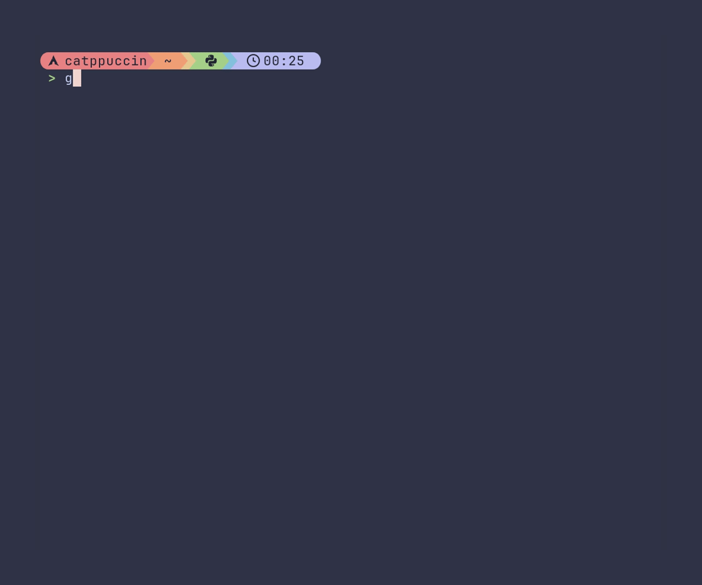
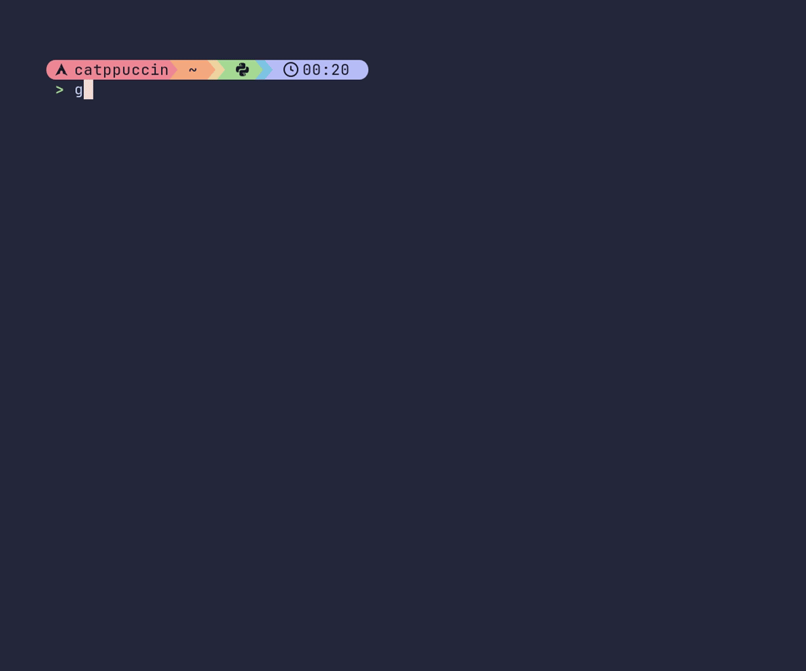
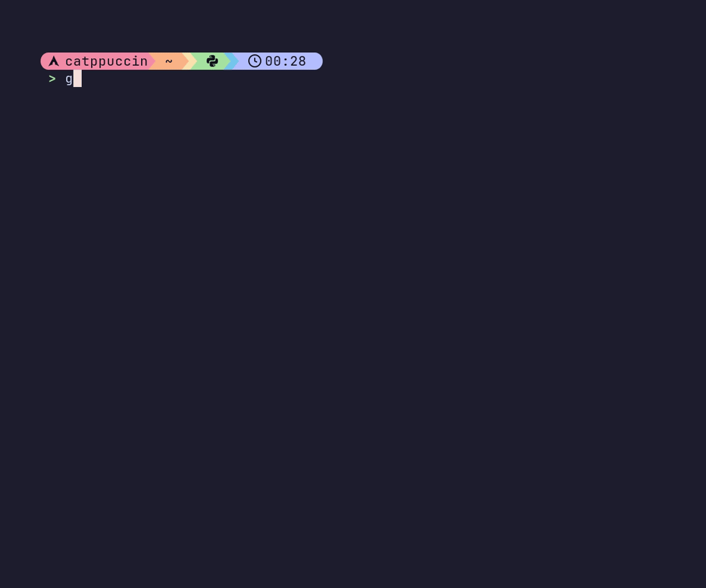

<h3 align="center">
	<br/>
	
	Catppuccin for <a href="https://github.com/charmbracelet/gum">Gum</a>
	
</h3>

<p align="center">
	<a href="https://github.com/holo96/catppuccin-gum/stargazers"></a>
	<a href="https://github.com/holo96/catppuccin-gum/issues"></a>
	<a href="https://github.com/holo96/catppuccin-gum/contributors"></a>
</p>

<p align="center">
  Exchanges signature gum pink for your favorite accent color
</p>  

## Previews
All previews use lavender as the accent color and mauve as the highlight color.
<details>
<summary>🌻 Latte</summary>

</details>
<details>
<summary>🪴 Frappé</summary>

</details>
<details>
<summary>🌺 Macchiato</summary>

</details>
<details>
<summary>🌿 Mocha</summary>

</details>

## Usage

### Bash/Zsh

1. Copy script to desired location, e.g. `~/gum-catppuccin.sh`.
  ```shell
  wget https://raw.githubusercontent.com/holo96/catppuccin-gum/refs/heads/main/gum-catppuccin.sh -O ~/gum-catppuccin.sh
  ```
2. Source the script to apply the Catppuccin theme for Gum (temporary for the current shell):
  ```shell
  source ~/gum-catppuccin.sh [latte|frappe|macchiato|mocha] [accent] [highlight]
  ```
   - To make it permanent, add the same `source` line to your `~/.bashrc` or `~/.zshrc`.
   - If you omit arguments, defaults are flavour `mocha`, accent `lavender`, and an auto-picked complementary highlight.

### Nushell

1. Copy the Nushell module to desired location, e.g. `~/gum-catppuccin.nu`:
  ```shell
  wget https://raw.githubusercontent.com/holo96/catppuccin-gum/refs/heads/main/gum-catppuccin.nu -O
  ~/gum-catppuccin.nu
  ```
2. Add and use `apply_gum_theme` function in your scripts or config:
  ```
  use ~/.config/gum/theme.nu apply_gum_theme
  apply_gum_theme                                      # defaults: mocha + lavender
  apply_gum_theme --flavour latte --accent peach       # auto-pick complementary highlight
  apply_gum_theme --accent red --highlight maroon      # manually specify highlight
  ```
  - All parameters are optional and have shell auto-completion support. The default values are same as Bash/Zsh version

<!-- The FAQ section is optional. Remove if needed.-->
## 🙋 FAQ

- Q: **_"How can I apply catppuccin theme to gum format?"_**\
  A: Gum format uses [glamour](https://github.com/charmbracelet/glamour) for theming, so you can use dedicated [Catppuccin glamour repo](https://github.com/catppuccin/glamour).
- Q: **_"Why colors are not applied to gum pager?"_**\
  A: Unfortunately, gum pager does not support colors at the moment. We should create an issue in the gum repo.

## 💝 Thanks to

- [holo96](https://github.com/holo96)

&nbsp;

<p align="center">
	
</p>

<p align="center">
	Copyright &copy; 2021-present <a href="https://github.com/catppuccin" target="_blank">Catppuccin Org</a>
</p>

<p align="center">
	<a href="https://github.com/catppuccin/catppuccin/blob/main/LICENSE"></a>
</p>
